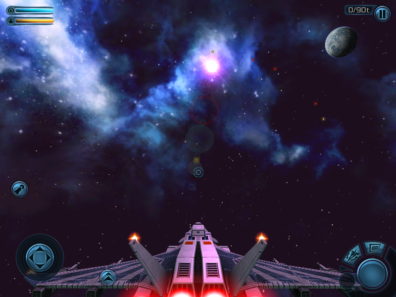

  

<b>Модификация Galaxy on Fire 2 для платформы J2ME, открывающий новые возможности для моддинга и ретро-гейминга.</b>
  <b>Важное примечание для правообладателей:</b>
 Этот проект является некоммерческим фанатским развитием, созданным из уважения и любви к оригинальной игре.
 Если вы против — мы найдем решение.

<b>Возможности:</b>
 Портированный сенсорный интерфейс с HD версий.1
 Плавное и точное управление, кастомизируемые кнопки и джойстик.
 Поддержка моделей из HD-версий: импорт моделей из GoF 2 для PC/iOS/Android через формат V4AEMesh.

<b>Открытая система моддинга:</b>
 Все игровые данные (корабли, системы, предметы) вынесены в легко редактируемые текстовые файлы.2

<b>Улучшенная графика:</b>
 Новые эффекты рендеринга, исправленные текстуры, поддержка прозрачности и свечения.

ОТКРЫТЬ

___

  
  
  

___
  

<b>Технические улучшения:</b>
 Оптимизированная загрузка ресурсов, исправление оригинальных багов, адаптация под современные эмуляторы и устройства.

<i>2011-2025 Hard Condition</i>
  <i>© 2009 Designed and developed by FISHLABS Entertainment GmbH, powered by ABYSS® Game
Engine. Galaxy on Fire 2™ and ABYSS® are registered trademarks of FISHLABS
Entertainment GmbH. All rights reserved. Further information is available at www.fishlabs.net</i>

Отдельная благодарность:
[DeepOpen Engine](https://github.com/BaalNetbek/DeepOpen)

Больше:\
 [Col-E/Recaf](https://github.com/Col-E/Recaf)\
 [shinovon/KEmulator](https://github.com/shinovon/KEmulator)\
 [Lookup tables for GoF2](https://docs.google.com/spreadsheets/u/1/d/e/2PACX-1vRjJFtnrG9-7vdqHtHtPCu0Tg7C-1A89lxo434_7fgEguS9I6O1u3wcRmoWnHEhgUP2Mbd9EMIzAPJA/pubhtml#)
   1 Полностью сенсорный интерфейс находится на стадии разработки.
  2 Инструкции по работе с внутриигровыми файлами будут предоставлены позже.
