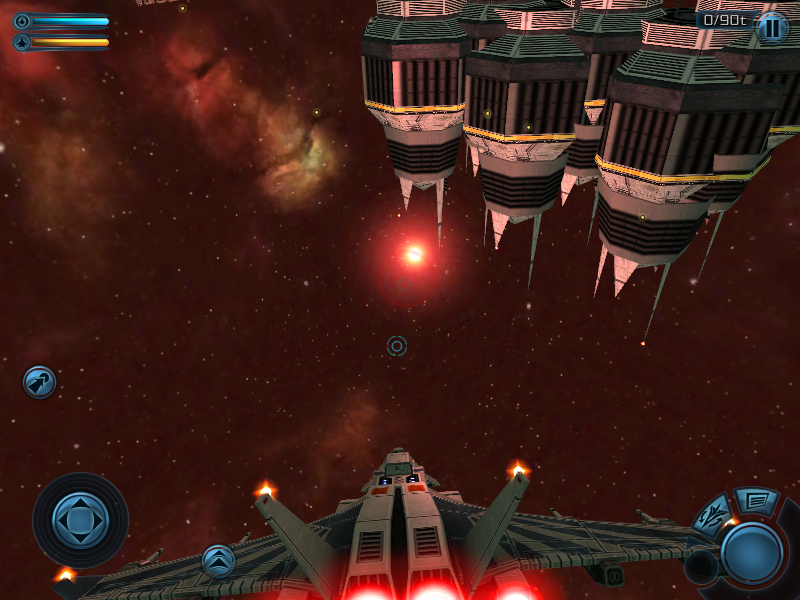
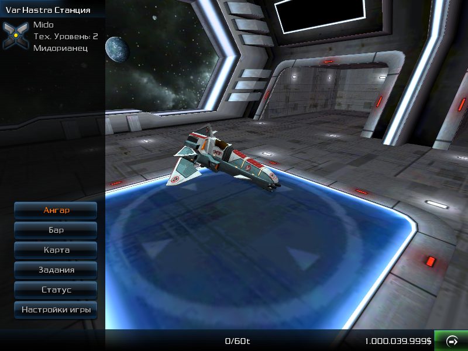

  

[RUSSIAN README](README_RU.md)

<b>A modification for Galaxy on Fire 2 on the J2ME platform, opening up new possibilities for modding and retro-gaming..</b>
  <b>Important note for rights holders:</b>
 This project is a non-commercial fan development, created out of respect and love for the original game.
 If you have any objections — we will find a solution.

 <b>Authors:</b>
 See the "About" section in the game for details.

<b>Features:</b>
 Ported touch interface from the HD versions.1
 Smooth and precise controls, customizable buttons and joystick.
 Support for models from HD versions: import models from GoF 2 for PC/iOS/Android via the V4AEMesh format.

<b>Open modding system:</b>
 All game data (ships, systems, items) is stored in easily editable text files.2

<b>Enhanced graphics:</b>
 New rendering effects, corrected textures, support for transparency and glow.

SHOW

___

  
  
  

___
  

<b>Technical improvements:</b>
 Optimized resource loading, fixes for original bugs, adaptation for modern emulators and devices.

<i>2011-2025 Hard Condition</i>
  <i>© 2009 Designed and developed by FISHLABS Entertainment GmbH, powered by ABYSS® Game
Engine. Galaxy on Fire 2™ and ABYSS® are registered trademarks of FISHLABS
Entertainment GmbH. All rights reserved. Further information is available at www.fishlabs.net</i>

---
More:\
[DeepOpen Engine](https://github.com/BaalNetbek/DeepOpen)\
 [Col-E/Recaf](https://github.com/Col-E/Recaf)\
 [shinovon/KEmulator](https://github.com/shinovon/KEmulator)\
 [Lookup tables for GoF2](https://docs.google.com/spreadsheets/u/1/d/e/2PACX-1vRjJFtnrG9-7vdqHtHtPCu0Tg7C-1A89lxo434_7fgEguS9I6O1u3wcRmoWnHEhgUP2Mbd9EMIzAPJA/pubhtml#)\
 [Telegram community (Russian)](https://t.me/HardCondition)\
 [Old versions of Reforged, including GF23 (until 2022)](https://drive.google.com/drive/folders/198TUt7ERvaK7kdShcHvn_otm48rbBnKV?usp=drive_link)
   1 A fully functional touch interface is currently under development.
  2 Instructions for working with the game data files will be provided later. You can view a preliminary version of the instructions [here](github/Engine_instructions_alpha.pdf).
  3 Galaxy Force 2 is the old and meaningless name for the mod used from 2011 to 2015.
