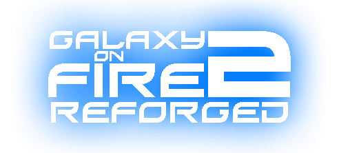
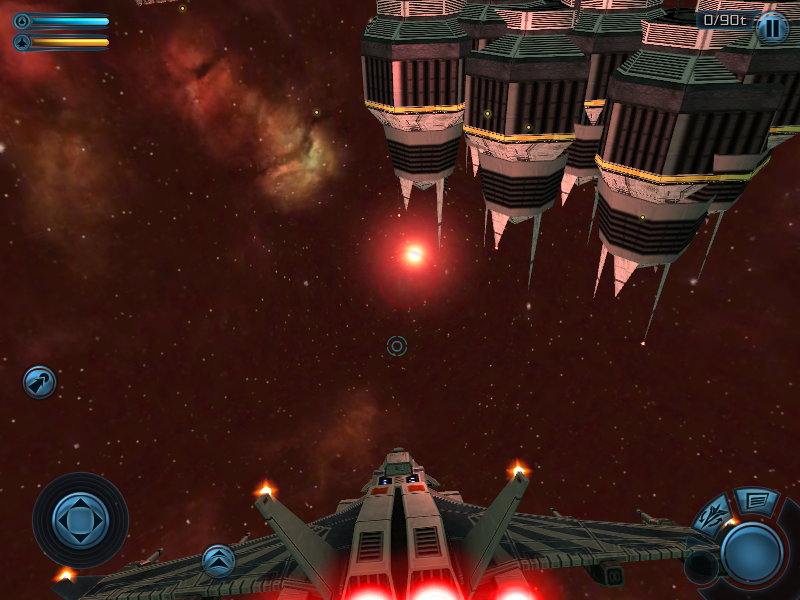
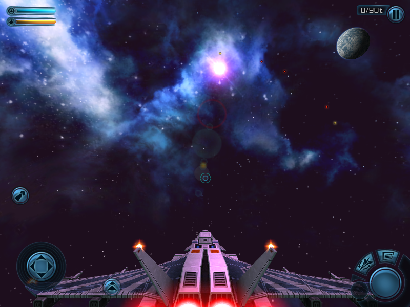
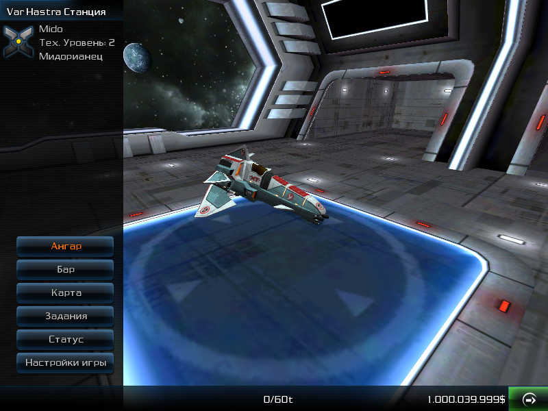

  

[ENGLISH README](README.md)

# Galaxy on Fire 2: Reforged
🚀 Неофициальная модификация **Galaxy on Fire 2** для платформы **J2ME**, открывающая новые возможности для моддинга и ретро-гейминга.

---

## ⚠️ Важное примечание для правообладателей
Этот проект является **некоммерческим фанатским развитием**, созданным из уважения и любви к оригинальной игре.  
Если вы против — мы найдём решение.

---

## 👥 Авторы
Подробности смотрите в разделе «Об игре».

---

## ✨ Возможности

- 🎨 **Сенсорный интерфейс** с HD-версий¹  
- 🎮 **Плавное и точное управление**, кастомизируемые кнопки и джойстик  
- 🛰 **Поддержка моделей** из HD-версий (импорт через формат `V4AEMesh`)  
- 🛠 **Открытая система моддинга**: корабли, системы и предметы вынесены в текстовые файлы²  
- 🌌 **Улучшенная графика**: новые эффекты рендеринга, исправленные текстуры, поддержка прозрачности и свечения  
- ⚡ **Технические улучшения**: оптимизированная загрузка ресурсов, исправления багов, адаптация под современные эмуляторы и устройства  

---

## 📸 Скриншоты

ОТКРЫТЬ

___

  
  
  

___

---

## 📥 Скачать
Готовую сборку можно найти во вкладке [**Releases**](https://github.com/Smert124/Galaxy-on-Fire-2-Reforged/releases).

---

## 🔗 Полезные ссылки
- [DeepOpen Engine](https://github.com/BaalNetbek/DeepOpen)  
- [Col-E/Recaf](https://github.com/Col-E/Recaf)  
- [shinovon/KEmulator](https://github.com/shinovon/KEmulator)  
- [Lookup tables for GoF2](https://docs.google.com/spreadsheets/u/1/d/e/2PACX-1vRjJFtnrG9-7vdqHtHtPCu0Tg7C-1A89lxo434_7fgEguS9I6O1u3wcRmoWnHEhgUP2Mbd9EMIzAPJA/pubhtml#)  
- [Сообщество в Telegram](https://t.me/HardCondition)  
- [Старые версии Reforged, включая GF2³ (до 2022)](https://drive.google.com/drive/folders/198TUt7ERvaK7kdShcHvn_otm48rbBnKV?usp=drive_link)  

---

## 📌 Примечания
1. Полностью рабочий сенсорный интерфейс находится на стадии разработки.  
2. Инструкции по работе с внутриигровыми файлами будут предоставлены позже. Предварительная версия: [Engine_instructions_alpha.pdf](github/Engine_instructions_alpha.pdf).  
3. *Galaxy Force 2* — старое и бессмысленное название мода (2011–2015).  

---

## 📜 Лицензия и права
<i>2011–2025 Hard Condition</i>  

© 2009 Designed and developed by **FISHLABS Entertainment GmbH**, powered by **ABYSS® Game Engine**.  
Galaxy on Fire 2™ и ABYSS® являются зарегистрированными товарными знаками **FISHLABS Entertainment GmbH**.  
Все права защищены. Подробнее: [www.fishlabs.net](http://www.fishlabs.net)
